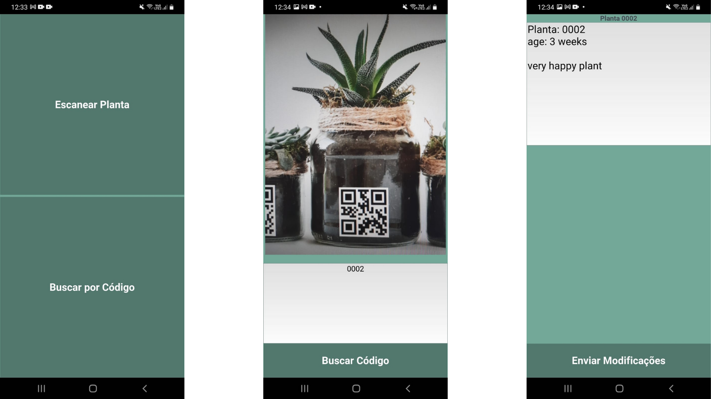

# Plant progress tracker app

Mobile app built with python that help to keep your plants alive and well.  

Coffee plants require precise nutrients intake and my main motivation was develop an application that I can keep tracker of quantity and date. I can print a QR code and put it somewhere in the coffee farm, when the fertilization day comes I can just scan de QR code and update the txt file. The txt file is saved at Firebase.  
  
  
### Technologies used  
- [Kivy](https://github.com/kivy/kivy)  
- [ZBarCam](https://github.com/kivy-garden/zbarcam) 
- [Firebase](https://firebase.google.com/)
- Python  
  
### Screenshots
  

https://user-images.githubusercontent.com/58222697/170534585-401b3a9e-aeb3-4c3a-9f26-b4e06a2ea3ac.mp4
